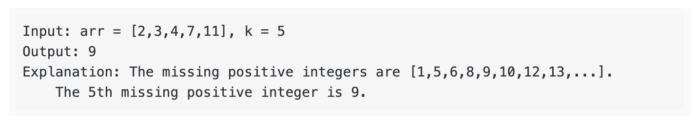

# Problem Solving Exercises 
Practice skills related to thinking about problems through a technical lens, to include:  
* Communicating and displaying thought processes prior to coding
* Considering requirements 
* Asking questions of myself that may provide clarity about design
* Writing basic unit tests to ensure understanding of input vs output and/or requisite changes to mutable objects  

## Format 
---  

The format of each PSE (problem solving exercise) will include: 
1. Problem statement describing requirements
2. A clarifying questions exercise to practice thinking through how to approach the problem.
3. An exercise practicing writing pseudo code.
4. A unit test file to both test the sollution as well as practice writing tests.
5. A history of all the different ways I approached the problem in chronological order, with older sollutions commented out.

---  

## **Example PSE - Rock, Paper, Scissors**  

**Problem Statement** 

Imagine working on software for a game of Rock, Paper, Scissors  .

Create a function named winner that takes two arguments, the move for player_1 and player_2 ("rock", "paper", or "scissors"), and returns the winner ("Player 1 wins!", "Player 2 wins!", or "It's a tie").

*Example Input/Output*

*Complete Rock, Paper, Scissors Rules*

**Clarifying questions** 

- How should the function handle invalid user input (i.e. player_1 = "lizards")?
- Should a user automatically lose if they have invalid input?
- What should happen if both users have invalid input?
- Does capitalization matter?
- Does extra whitespace / punctuation matter?
- Should anything be printed to the console?
- Is the speed / memory usage of this function important?
- Should there be a default value for each of the arguments?

**Pseudo Code** 

- Check if player_1 and player_2 are in ["rock", "paper", "scissors"]
- If not, return None

Check for a tie:
- If player_1 == player_2, return "It's a tie!"
- First deal with the case that player_1 == "rock"
- If player_2 == "scissors", return "Player 1 wins!"
- Else (player_2 = "paper"), return "Player 2 wins!"
- Next deal with the case that player_1 == "paper"
- If player_2 == "rock", return "Player 1 wins!"
- Else (player_2 = "scissors"), return "Player 2 wins!"
- Next deal with the case that player_1 == "scissors"
  If player_2 == "rock", return "Player 2 wins!"
- Else (player_2 = "paper"), return "Player 1 wins!"

## **PSE 1 - Highest Rated**  

**Problem Statement** 

Create a function named `get_highest_rated` that is responsible for finding the highest rated restaurant.  

The function should take in a list of dictionaries named `restaurants` as a parameter. Each dictionary represents the data associated with a restaurant, including its rating. This function should have a return value of the restaurant with the highest rating.  

*Example Input/Output*

**Clarifying questions**  

What should the function return if there are multiple restaurants tied for the highest rating?
How should the function handle restaurant dictionaries with missing data (name or rating)?
How should the function handle restaurant dictionaries with keys in addition to "name" and "rating"?
How should the function handle non-numerical values for "rating"?
How should the function handle input that is a single dictionary (not a list)?

**Pseudo Code** 

- Get the highest dict value
- If only 1 one highest value -> return message with highest rating
- If multiple tied for highest value -> return message with highest rating
- If no valid input available return "None"

---  

## **PSE 2 - Adagrams**  

**Problem Statement** 

Imagine programming the logic for a word game.

In this game, every player submits one word. Each word gets a score based on the letters in the word and its point value.

Create a function named score that is responsible for scoring a given word.
This function should take in a string named word as a parameter. This function should return the word's total number of points.

Refer to this table for the point values of each letter.

*Letter	Value*

*Examples*

**Clarifying questions**  

- Do we need to verify case? With which method? Test for this.
- Empty word string returns 0. Verify with test.
- Duplicate letters return the correct score. Verify with test.

**Pseudo Code** 

- Make a dict where each key is a letter and each value the score.
- Make a var to hold the value
- Write a loop so that for each letter in the word we look up the corresponding score value in the dict and add it to the value var.
- Return the value var

---  

## **PSE 3 - Hamming**  

**Problem Statement**  

Imagine working on software that analyzes mutations in DNA.

Create a function named hamming_distance that calculates the number of differences between two DNA strands (aka two strings). This method should take in two different DNA strands of the same length as parameters. This method should have a return value of the number of differences between each string.

For example, given these two DNA strands (strings), hamming_distance should return 7 because there are 7 differences:

Sourced from http://rosalind.info/problems/hamm/

**Clarifying questions** 

- If strands empty:
raise ValueError
- If strands not equal length:
raise ValueError
- If strand is not a string:
raise ValueError

**Pseudo Code** 

- check if strands are strings if not raise ValueError
- check if strands are empty if not raise ValueError
- check if strands are same length if not raise ValueError
- implement a counter
- make loop counting over each character in strand1
- check if index in strand1 == index in strand2
- increase counter if True
- return counter

---  

## **PSE 4 - Palindrome**  

**Problem Statement**  

Imagine working on software that processes text. A palindrome is a word, phrase, or sequence that reads the same backward as forward.

Create a function named palindrome that determines if a string is a palindrome. This method should take in one string as a parameter. This method should return True if the string is a palindrome.

*Examples*

**Clarifying questions** 

- does case matter?
-> convert to same case
- how to handle punctuation marks?
-> ignore them in the comparison?
- how to handle invalid input?
-> raise input error
- numerical palindromes?
-> should handle them as well so needs to handle letters and numbers
- how to handle spaces?
-> ignore them
- how to handle lists?
-> convert to single string

**Pseudo Code** 

Check if input is valid 
-> if empty or dict raise value error
Convert input to a string
Remove spaces, case, and punctuation
Use index to test if backwards is same as forwards
Return True

---  

## **PSE 5 - Pairs With a Given Sum**  

**Problem Statement**  

Imagine working on software that processes lists of numbers. Create a function named pairs_with_given_sum It finds the number of pairs of numbers in a list which add up to a given target. This function should take in a list of whole numbers and a target as parameters. This function should have a return value of the integer of number of pairs.

Sourced from: [Geeks for Geeks](https://www.geeksforgeeks.org/count-pairs-with-given-sum/) 

**Clarifying questions** 

- Does list/target contain negative numbers? 
  Assume yes and write code to handle negative numbers appropriately
- Does list/target contain floats?
  Assume yes and round to 2 decimal places
- Is the list sorted?
  Assume no, convert list to dict for faster referencing
- Return in case of empty?
  Raise error
- What if target is not a number?
  Raise error
- What if item in list is not a number?
  Ignore if there are numbers, otherwise raise an error saying no valid input
- Assume numbers can't be reused because otherwise the list would be a set

**Pseudo Code** 

- Check if target is number -> raise type error
- Check if list is empty -> raise value error
- check if list contains numbers - raise value error

Loop over list and for each 
- find it's complement by subtracting it from the target
- add to dict
- look up if complement is in dict
- if yes add to count 
- return count

---  

## **PSE 6 - Merging Sorted Lists**  

**Problem Statement**  

Imagine working on software that processes lists of numbers. Create a function named merge_lists that takes two sorted lists and merges them into a single sorted list. This function should take in two lists of whole numbers. The function should return a new sorted list which consists of the elements of the two arguments.

Sourced from: [Leetcode](https://leetcode.com/problems/merge-sorted-array/) 

**Clarifying questions** 

- duplicate numbers in list? -> merge only once using set?
- modify one of the input lists or create a new results one? -> create new list
- how to handle non-numerical items in list? -> raise error
- what if one list is empty? -> return other one sorted
- what if both of them are empty? -> raise error

**Pseudo Code** 

if both lists empty, raise error
if list1 empty, return list2
if list 2 empty, return list 1

elif if 0 index of list1 > than 0 index of lists
return 0 index of list 1 + a recursive call of the merge function for all other positions
else return 0 index of list 2 + recursive call of the merge function for all other positions

for recursion:
num + whichever one is biggest of list1[0] and list2[0]

---  

## **PSE 7 - Reshape the Matrix**  

**Problem Statement**  

In MATLAB, a programming platform for numeric computing, there is a very useful function called 'reshape', which can reshape a matrix into a new one with different size but keep its original data.

You're given a matrix represented by a two-dimensional array, and two positive integers r and c representing the number of rows and number of columns of the wanted reshaped matrix, respectively.

The reshaped matrix need to be filled with all the elements of the original matrix in the same row-traversing order as they were.

If the 'reshape' operation with given parameters is possible and legal, output the new reshaped matrix; Otherwise, output the original matrix.

*Example 1:*

*Explanation:*

The row-traversing of nums is [1,2,3,4]. The new reshaped matrix is a 1 * 4 matrix, fill it row by row by using the previous list.

*Example 2:*

*Explanation:*

There is no way to reshape a 2 * 2 matrix to a 2 * 4 matrix. So output the original matrix.

*Example 3:*

*Explanation:*

The original matrix was 4 * 2. The new reshaped matrix is a 2 * 4 matrix, fill it row by row by using the previous list.

*Note:*

The height and width of the given matrix is in range [1, 100]. The given r and c are all positive.

Sourced from: [Leetcode](https://leetcode.com/problems/reshape-the-matrix/) 

**Clarifying questions** 

- Should new matrix be a copy or replace the original?
Doesn't specify so put in new var for now.
- What if inputs exceed the constraints given?
Throw error
- Should there be a text output when the original is returned?
Yes, letting the user know is nice so that it's clear nothing went wrong.
- What if any of the inputs are invalid?
Throw error.

**Pseudo Code** 

- Create a one-dimensional list from the original matrix
    one_list = []
    for row in matrix:
        for column in row:
            append column to one_list

- Check if the reshaped matrix is valid
    if r * c is not equal to the length of one_list:
        return the original matrix

- Reshape the matrix
    reshaped_matrix = create an empty two-dimensional list
    for i from 1 to r:
        create a new row_list
        for j from 1 to c:
            pop the first element from one_list and append it to row_list
        append row_list to reshaped_matrix

- return reshaped_matrix

---  

## **PSE 8 - Kth Missing Positive Number**  

**Problem Statement**  

Given an array arr of positive integers sorted in a strictly increasing order, and an integer k.

Find the kth positive integer that is not present in the array.

*Example 1:*

*Example 2:*

**Clarifying questions** 

error handling edge cases:
- empty array 
- k is a negative num

What if k is larger than the array of missing positive ints or there are no missing ints in the set?
- add ints past last int in array

Does something need to be done in case the array contains extremely large numbers?
- Ensure the method of counting the missing numbers doesn't exceed the size of K

**Pseudo Code** 

if not arr or k == negative num throw error

Implement missing num counter
Implement missing num tracker

if num count != k:
num tracker += 1
if num tracker not in arr num counter += 1
else return num counter

---  

## **PSE 9 - **  

**Problem Statement**  

**

**

**Clarifying questions** 

**Pseudo Code** 

---  

## **PSE 10 - **  

**Problem Statement**  

**

**

**Clarifying questions** 

**Pseudo Code** 